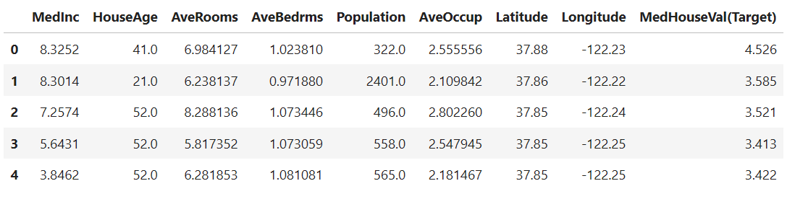
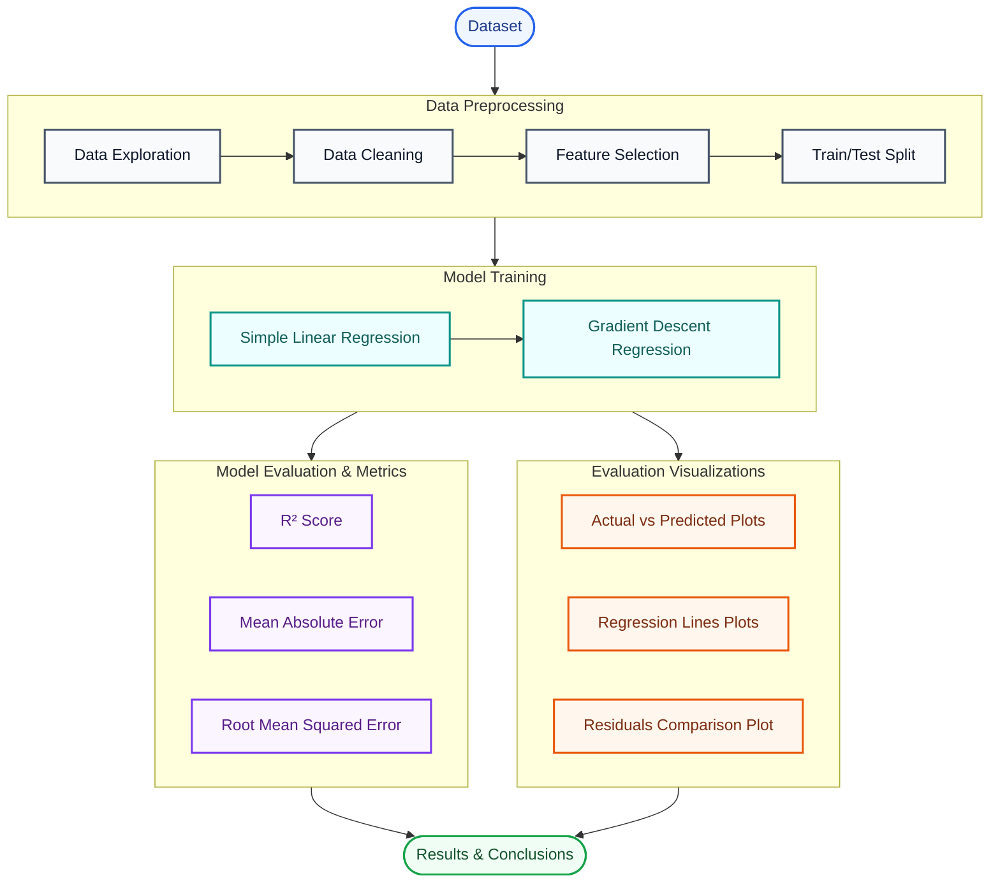
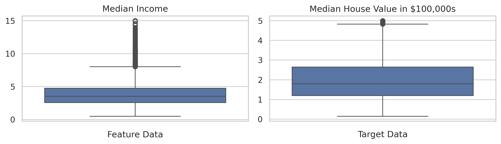
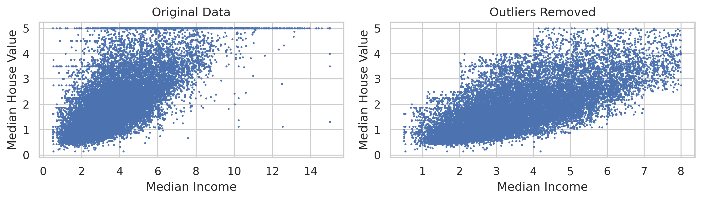
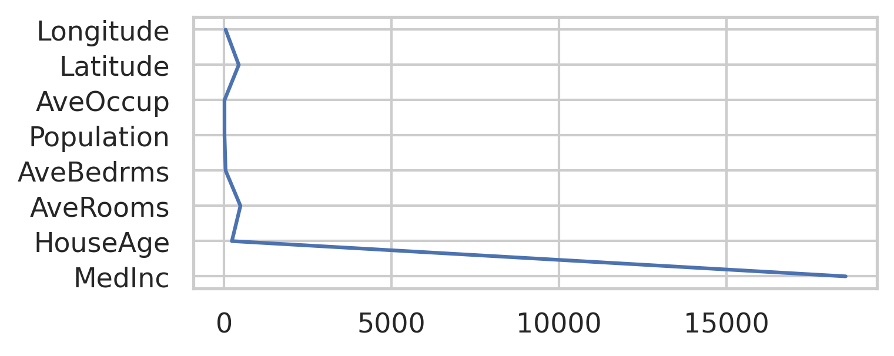
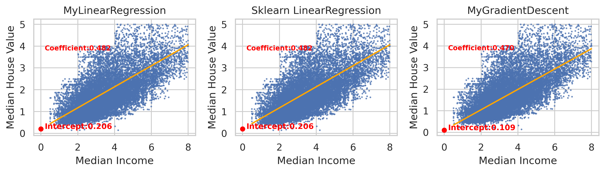
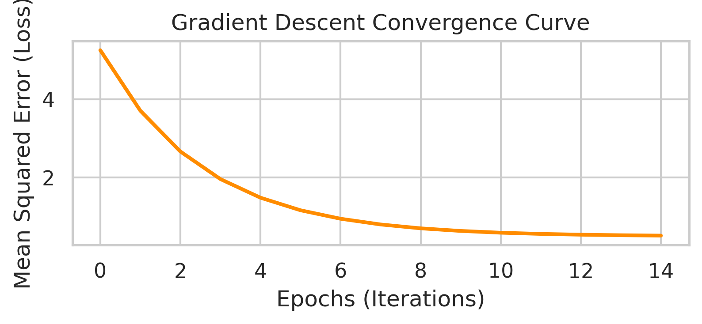
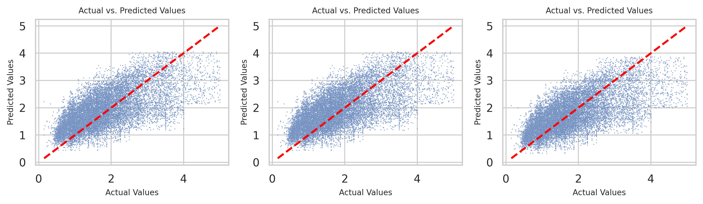
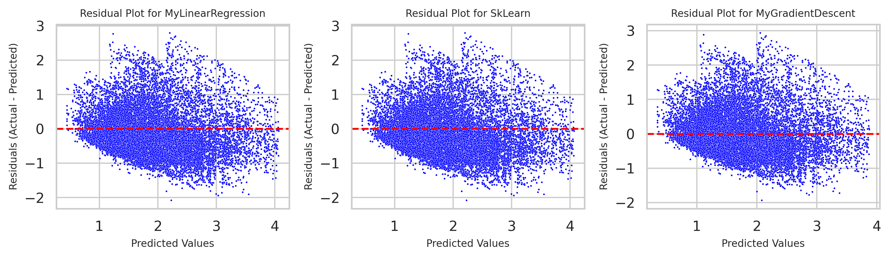

# California Housing Price Prediction
### Implementing Linear Regression and Gradient Descent from Scratch


## Overview

This project explores the implementation of supervised machine learning algorithms for predicting California housing prices. Rather than relying solely on existing machine learning libraries, this project focuses on understanding the mathematical foundations behind Linear Regression by implementing two different approaches from scratch.

The project compares an analytical solution for Linear Regression with an iterative Gradient Descent optimization algorithm and evaluates their performance against the implementation provided by Scikit-learn.

The notebook is organized as a complete case study, including data exploration, preprocessing, model implementation, evaluation, and comparison of results.

---

## Objectives

- Explore the California Housing dataset
- Perform data cleaning and exploratory data analysis
- Select relevant features for prediction
- Implement Linear Regression from scratch
- Implement Gradient Descent optimization from scratch
- Compare custom implementations with Scikit-learn
- Evaluate prediction performance using common regression metrics

---

## Dataset

**Dataset:** California Housing Dataset

The dataset contains demographic and housing information collected from districts across California. The objective is to predict the median house value using several socioeconomic and geographic features.

### Dataset Summary

| Property | Description |
|-----------|-------------|
| Samples | 20640 |
| Features | 8 |
| Selected Features | Median Income |
| Target Variable | Median House Value |

### Dataset Overview



---

# Project Workflow

The overall workflow followed during the project is illustrated below.



---

# Repository Structure

```
California-Housing-Prediction/
│
├── Assets/
│   ├── hero-banner.png
│   ├── dataset-overview.png
│   ├── project-workflow.png
│   ├── eda.png
│   ├── preprocessing.png
│   ├── feature-selection.png
│   ├── regression-line.png
│   ├── gradient-descent-loss.png
│   ├── predictions.png
│   └── residuals.png
│
├── LinearRegression_Comparison.ipynb
├── requirements.txt
├── README.md
└── LICENSE
```

---

# Exploratory Data Analysis

The exploratory analysis investigates the characteristics of the dataset before model development. This stage includes understanding feature distributions, identifying relationships between variables, and detecting potential outliers.



**Recommended figures**

- Feature distributions
- Correlation heatmap
- Scatter plots
- Summary statistics table

---

# Data Preprocessing

Data preprocessing prepares the dataset for model training.

Topics covered include:

- Data inspection
- Missing values (if applicable)
- Outlier detection
- Feature selection
- Train/Test split



---

# Feature Selection

Feature selection was performed to identify the variables that contribute most to predicting housing prices while reducing unnecessary complexity.

Explain in the notebook:

- Why feature selection was performed
- Selection method
- Features retained
- Impact on model performance



---

# Custom Model Implementation

## Linear Regression

The first implementation estimates the regression coefficients using the analytical solution. This serves as a baseline for comparison with the iterative optimization approach.

Include in notebook:

- Mathematical intuition
- Algorithm explanation
- Implementation details



---

## Gradient Descent

The second implementation estimates the model parameters iteratively using Gradient Descent.

Discuss:

- Cost function
- Learning rate
- Number of iterations
- Convergence
- Parameter updates



---

# Model Evaluation

Performance is evaluated using standard regression metrics.

| Model | R² | MAE | RMSE |
|--------|----|------|------|
| Custom Linear Regression | 0.412818 | 0.544477 | 0.687978 |
| Gradient Descent | 0.425405	| 0.519747 | 0.680564
| Scikit-learn | 0.412818 | 0.544477 | 0.687978 |

---

# Results

Compare the predictions generated by each implementation and discuss similarities and differences.

### Predictions



### Residual Analysis



---

# Key Takeaways

Example topics to summarize:

- Differences between analytical and iterative optimization
- Advantages of implementing algorithms from scratch
- Importance of feature selection
- Lessons learned during debugging and experimentation

---

# Future Improvements

Potential extensions include:

- Multiple Linear Regression
- Polynomial Regression
- Ridge Regression
- Lasso Regression
- Cross Validation
- Mini-batch Gradient Descent
- Hyperparameter tuning
- Additional feature engineering

---

# Technologies

- Python
- NumPy
- Pandas
- Matplotlib
- Scikit-learn
- Jupyter Notebook

---

# Installation

Clone the repository

```bash
git clone https://github.com/yourusername/california-housing-prediction.git
```

Install dependencies

```bash
pip install -r requirements.txt
```

Launch Jupyter Notebook

```bash
jupyter notebook
```

Open

```
LinearRegression_Comparison.ipynb
```

---

# References

- California Housing Dataset
- Scikit-learn Documentation
- Python Documentation

---

# License

This project is intended for educational and portfolio purposes.